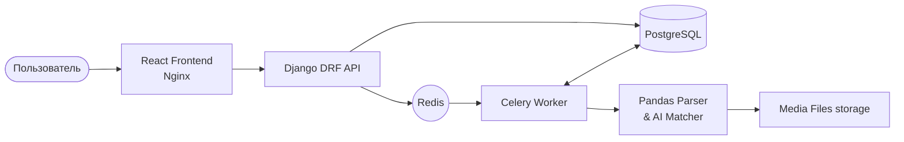

# 🏢 AI Price Management System & Estimate Matcher


Полноценная B2B веб-платформа для автоматизации документооборота, управления базами поставщиков и AI-сопоставления строительных смет с использованием нечеткой логики и алгоритмов машинного обучения.

Проект создан для полного замещения рутинных процессов, основанных на обработке "грязных" Excel-файлов, и обеспечивает централизованную работу нескольких пользователей.

---

## ✨ Ключевые возможности (Features)

*   🧠 **AI-Сопоставление (RAG Architecture Pipeline):**
    *   Сложный алгоритм нормализации "грязных" позиций из клиентских смет.
    *   Реранкинг (Reranking) на основе `RapidFuzz` (расстояние Левенштейна) для точного сопоставления с базой номенклатуры.
    *   Система индикации уверенности ИИ (Confidence thresholds: High >80%, Medium 50-80%, Low < 50%).
*   🚀 **High-Performance асинхронный парсинг:**
    *   Обработка тяжелых Excel-файлов (тысячи строк) в фоновом режиме через **Celery + Redis**.
    *   Применение `pandas` с оптимизацией потребления памяти.
    *   Использование `bulk_create` для устранения N+1 проблем при сохранении в базу.
*   📊 **Динамический UI-маппинг:**
    *   Интерактивный мастер загрузки (Upload Wizard) на React.
    *   Живое превью данных (чтение первых 50 строк) перед полным парсингом.
    *   Кастомный выбор start_row / start_column прямо из интерфейса.
*   🛡️ **Hardened Security & Аудит:**
    *   MIME-type File validation (защита от маскировки расширений `.exe` -> `.xlsx`).
    *   Автоматический лог аудита (`ChangeLog`) через Django Signals (pre_save/post_save).
    *   Полностью изолированная внутренняя Docker-сеть баз данных.

---

## 🏛️ Архитектура



### Структура монолита (Django Apps)
*   `core` — Базовые абстракции, аудит логов, защитные file validators, кастомная пагинация.
*   `pricelists` / `suppliers` — Управление контрагентами и загруженными прайс-листами.
*   `projects` — Модуль загрузки смет (Estimates), вызова AI-алгоритма матчинга.
*   `catalog` — Глобальная "идеальная" номенклатура компании.

---

## 🚀 Быстрый старт (Local Development)

### Требования
*   Docker & Docker Compose
*   Git

### Развертывание

1. **Склонируйте репозиторий:**
```bash
git clone https://github.com/your-username/test_simple_way.git
cd test_simple_way
```

2. **Запустите Docker Compose** (поднимет 5 изолированных контейнеров):
```bash
docker compose up -d --build
```

3. **Создайте Суперпользователя** (для админ-панели):
```bash
docker compose exec backend python manage.py createsuperuser
```

**🌐 Доступные интерфейсы:**
*   Frontend (React UI): http://localhost:5173
*   Backend REST API: http://localhost:8000/api/
*   Django Admin: http://localhost:8000/admin/

---

## 🧪 Тестирование

Бэкенд покрыт тестами (pytest + pytest-django). Система тестов автоматически использует `CELERY_TASK_ALWAYS_EAGER=True` для мокирования брокера и `--reuse-db` для ускорения.

Запуск тестового набора внутри изолированного контейнера:
```bash
docker compose run --rm backend python -m pytest -v
```

---

## 💻 Tech Stack (Подробно)

| Уровень | Технологии |
| :--- | :--- |
| **Backend Framework** | Django 5.1, DRF |
| **Backend Language** | Python 3.12 |
| **Background Processing**| Celery 5.4 |
| **Message Broker** | Redis 7 (с аутентификацией) |
| **Database** | PostgreSQL 16 (с индексацией `db_index`) |
| **Data Science / ETL** | pandas, RapidFuzz |
| **Frontend** | React 18, TypeScript, Vite |
| **State & UI** | TanStack Query (React Query), Ant Design 5.x |
| **Testing** | Pytest, Faker, MagicMock |

---
*Developed with focus on production-ready architecture, scalability, and code maintainability.*
